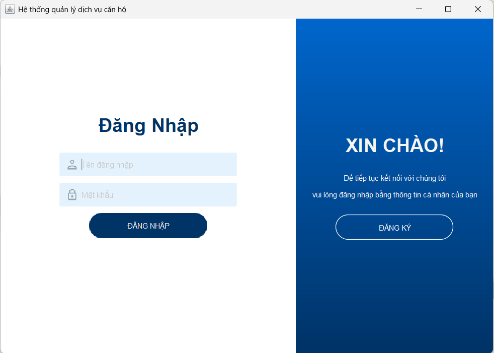

# Quản lý thu phí dịch vụ căn hộ
## Bài tập lớn môn Lập trình hướng đối tượng sử dụng Java + Mô hình MVC + XML 
## Nhóm 5
Thành viên nhóm bao gồm:
- Nguyễn Văn Thăng
- Phạm Văn Sự
- Đặng Anh Tuyền
## Getting Started
1. Tải source code về tại:
https://github.com/nguyenthang23092005/nhom5_quanlydichvuthuphicanho.git
2. Giải nén và mở source code bằng Apache Netbeans.
3. Chạy source code bằng cách chọn vào file 'Main.java' + 'Shift + F6'. Hoặc sử dụng ứng dụng đã được đóng gói '\target\ResiTrack.jar'.
## Tài khoản
- **Tài khoản**: *ngthang*
- **Mật khẩu**: *ngthang*
- **Tài khoản**: *phamsu*
- **Mật khẩu**: *phamsu*
- **Tài khoản**: *dangtuyen*
- **Mật khẩu**: *dangtuyen*
## Đăng kí tài khoản
Cần điền thêm email có định dạng đúng(có đuôi *@gmail.com*).
## Giao diện

