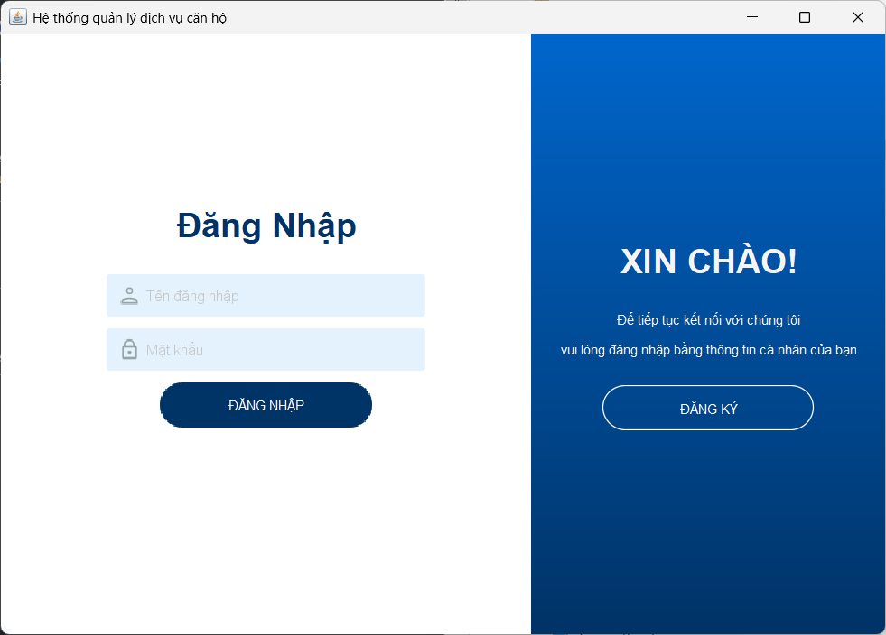
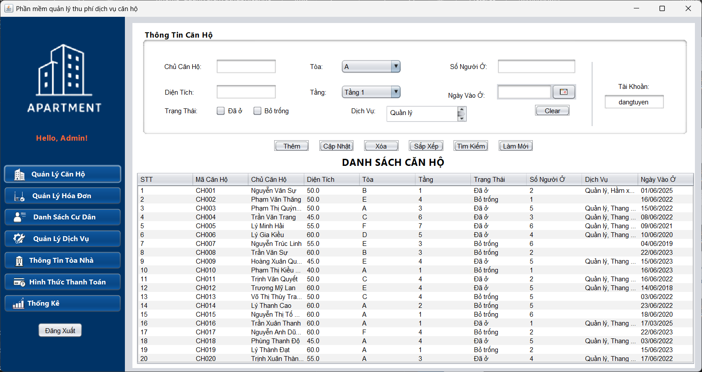

# Quản lý thu phí dịch vụ căn hộ
## Bài tập lớn môn Lập trình hướng đối tượng sử dụng Java + Mô hình MVC + XML 
## Nhóm 5
Thành viên nhóm bao gồm:
- Nguyễn Văn Thăng
- Phạm Văn Sự
- Đặng Anh Tuyền
## Getting Started
1. Tải source code về tại:
https://github.com/nguyenthang23092005/nhom5_quanlydichvuthuphicanho.git
2. Giải nén và mở source code bằng Apache Netbeans.
3. Chạy source code bằng cách chọn vào file `Main.java` + `Shift + F6`. Hoặc sử dụng ứng dụng đã được đóng gói `./target/ResiTrack.jar`.
## Tài khoản
- **Tài khoản**: `ngthang`
- **Mật khẩu**: `ngthang`
- **Tài khoản**: `phamsu`
- **Mật khẩu**: `phamsu`
- **Tài khoản**: `dangtuyen`
- **Mật khẩu**: `dangtuyen`
## Đăng kí tài khoản
- Cần điền thêm email có định dạng đúng(có đuôi `@gmail.com`).
## Giao diện
### Giao diện Đăng Nhập

### Giao diện Đăng Kí

### Giao diện Quản Lý Căn Hộ

### Giao diện Quản Lý Hóa Đơn

### Giao diện Danh Sách Cư Dân

### Giao diện Quản Lý Dịch Vụ

### Giao diện Thông Tin Tòa Nhà

### Giao diện Hình Thức Thanh Toán

### Giao diện Thống Kê

# The End
